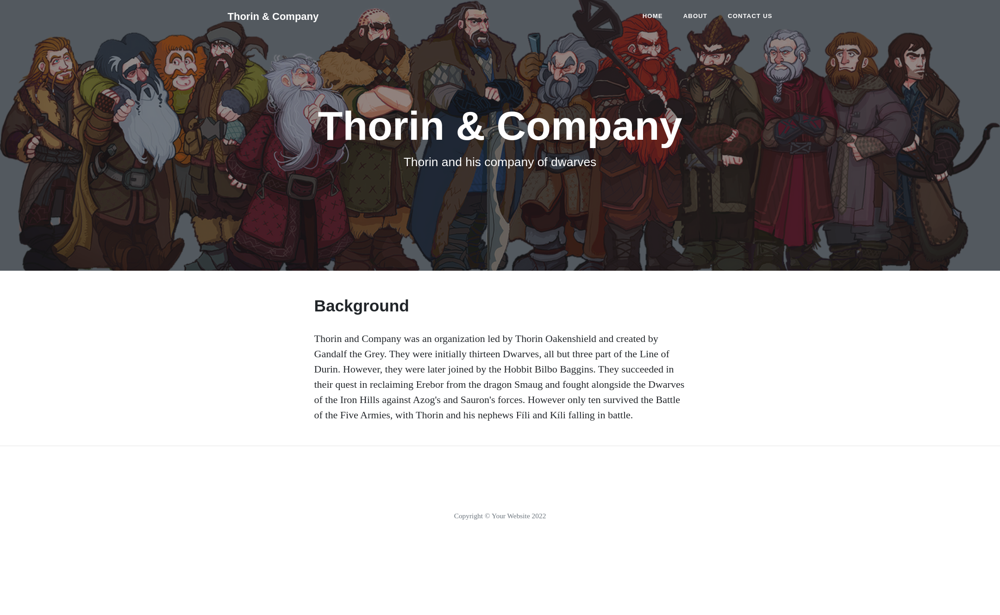

# Overview

Thorin & Company is a flask app dedicated to Tolkien's Lord of the rings universe.
It is a small wiki providing info on Thorin Oakenshield and a group of thirteen Dwarves, the Wizard Gandalf, and the Hobbit Bilbo Baggins.

## Exercise goals
* Creating and running a Flask application.
* Serving HTML, CSS, and JavaScript files from the backend.
* Make the code reusable by using template logic.
* Post data from HTML form.

## Technology used
* HTML5
* Bootstrap
* Javascript
* Flask framework
* Jinja templating engine

## Screenshot

